# Arquitectura y Flujo del Backend NutrieScan API

## Diagrama General del Sistema

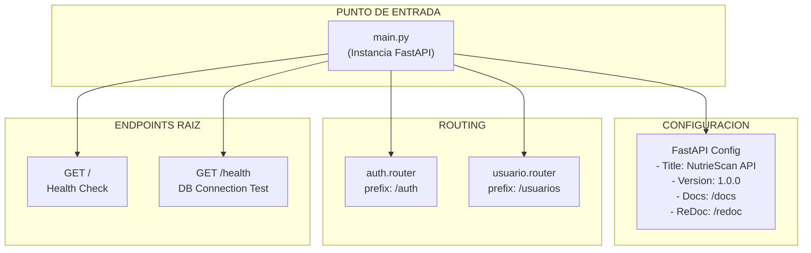

## Flujo Completo por Endpoint

### 1. AUTENTICACION CON GOOGLE ✓

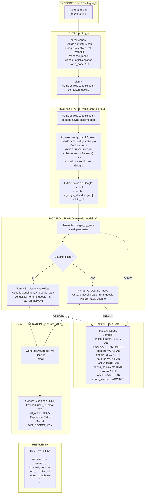

### 2. VERIFICAR JWT Y OBTENER DATOS USUARIO - GET /usuarios/me

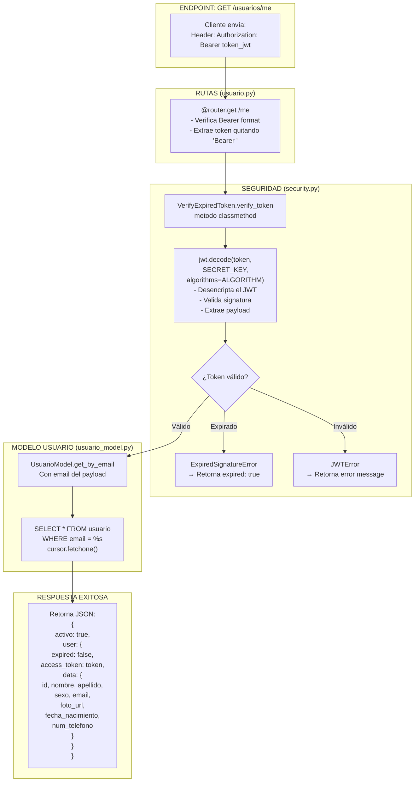

### 3. ACTUALIZAR PERFIL USUARIO - PATCH /usuarios/me

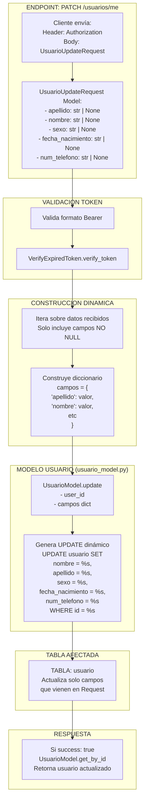

### 4. GUARDAR/OBTENER DATOS CORPORALES

#### 4.1 POST /usuarios/me/datos-corporales (Primera vez)

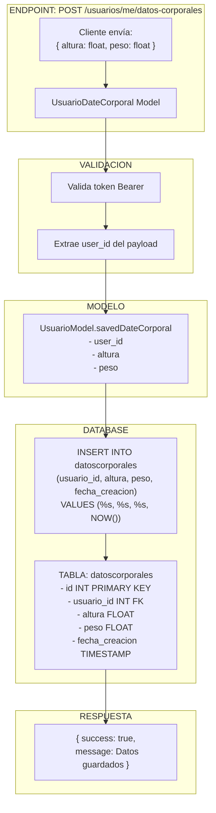

#### 4.2 GET /usuarios/me/datos-corporales

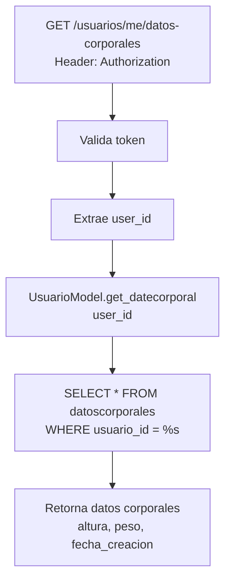

#### 4.3 PATCH /usuarios/me/datos-corporales (Actualizar)

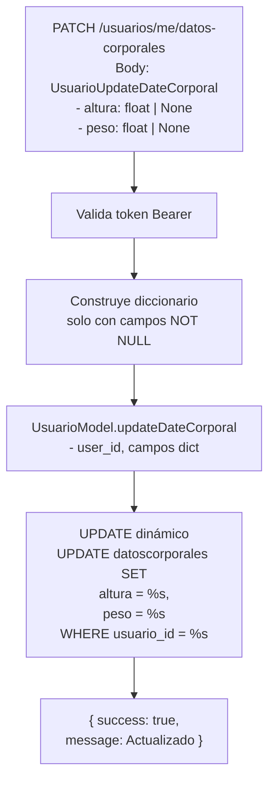

### 5. OBJETIVO DE PESO Y METAS NUTRICIONALES

#### 5.1 POST /usuarios/me/objetivo-peso (Calcular metas)

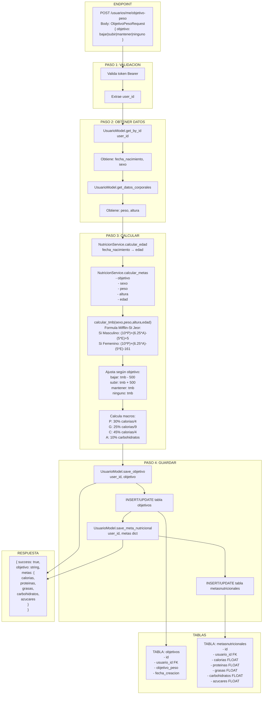

#### 5.2 GET /usuarios/me/objetivo-peso

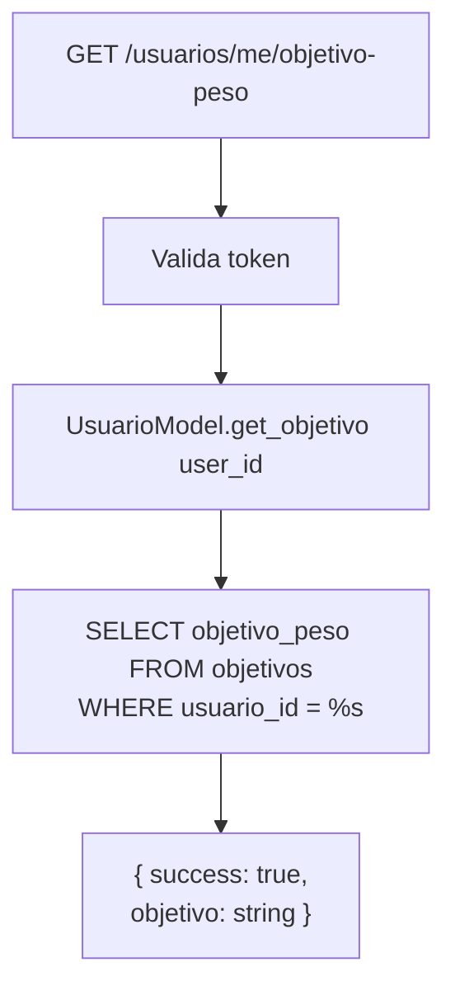

#### 5.3 GET /usuarios/me/meta-nutricional

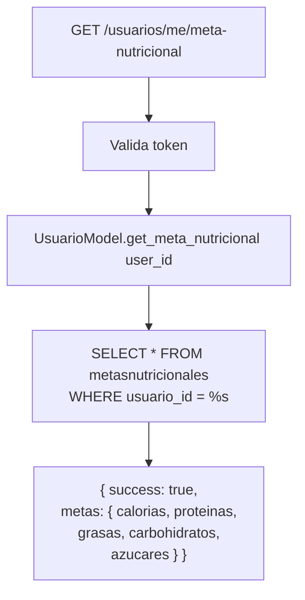

#### 5.4 POST y PATCH /usuarios/me/meta-nutricional/ninguno

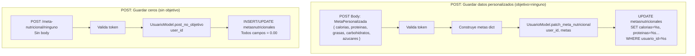

### 6. ENFERMEDADES CORPORALES (SALUD CORPORAL)

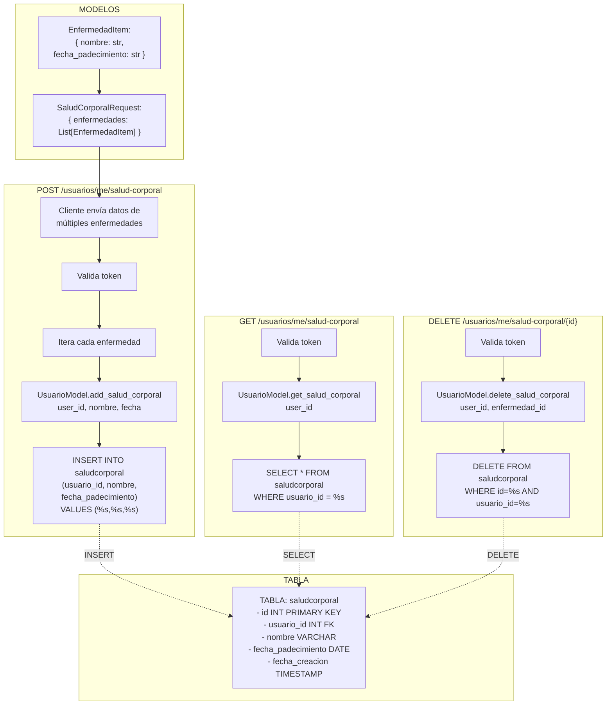

### 7. ENFERMEDADES ALIMENTICIAS (SALUD ALIMENTICIA)

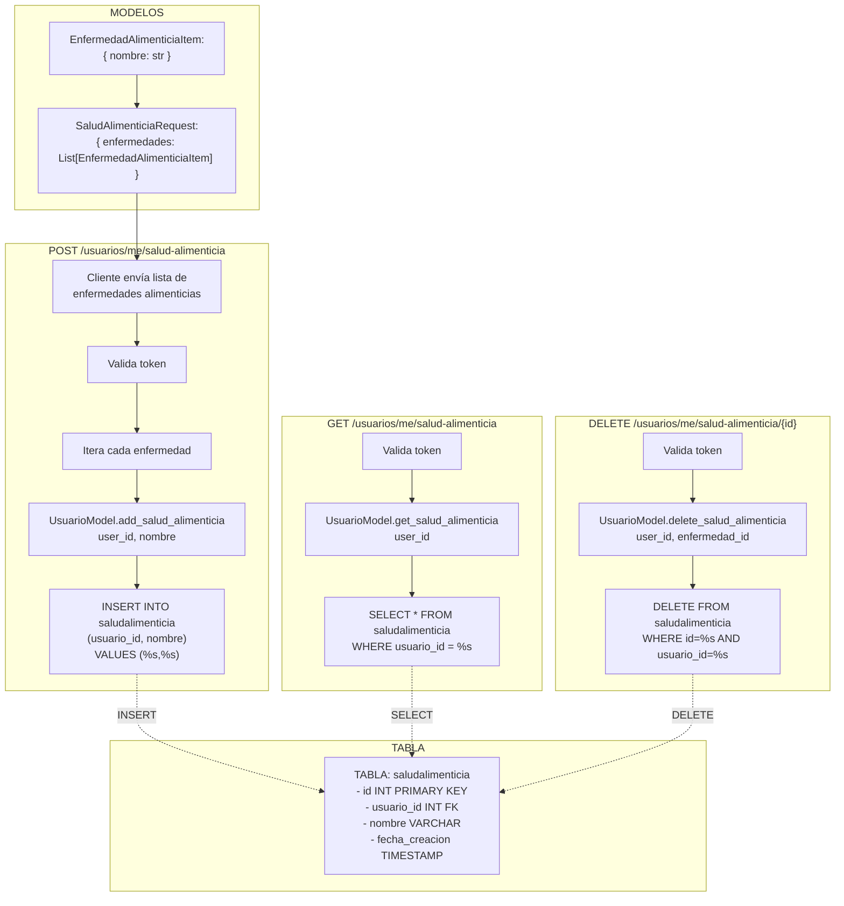

## Estructura de Clases y Funciones Explicadas

### ROUTES (Capa de Rutas - Definición de Endpoints)

#### auth.py
- **GoogleTokenRequest**: Modelo Pydantic - Valida que token sea string
- **GoogleLoginResponse**: Modelo Pydantic - Estructura respuesta: status, usuario, mensaje
- **@router.post("/google")**: Endpoint que recibe token Google y ejecuta AuthController.google_login()

#### usuario.py
- **Modelos Pydantic**: Define estructura datos entrada/salida
  - UsuarioUpdateRequest
  - UsuarioDateCorporal
  - UsuarioUpdateDateCorporal
  - EnfermedadItem, SaludCorporalRequest
  - EnfermedadAlimenticiaItem, SaludAlimenticiaRequest
  - ObjetivoPesoRequest, MetaPersonalizada
- **@router.get/post/patch/delete**: Define endpoints que:
  1. Validan token Bearer
  2. Extraen user_id de payload
  3. Llaman funciones de Model
  4. Retornan respuestas JSON

### CONTROLADORES (Capa de Lógica de Negocio)

#### auth_controller.py - AuthController
- **GOOGLE_CLIENT_ID**: Constante - ID de la app en Google Cloud
- **google_login(token_google)**: Async classmethod
  - Verifica token OAuth2 de Google usando `id_token.verify_oauth2_token()`
  - Extrae: email, nombre, google_id, foto_url
  - Llama UsuarioModel para buscar/crear usuario
  - Genera JWT si es exitoso
  - Retorna dict con usuario y token

### MODELOS (Capa de Base de Datos)

#### usuario_model.py - UsuarioModel
Todas las funciones son @staticmethod (no necesitan instancia)

**Crear Usuario:**
- `create_from_google(email, nombre, google_id, foto_url)`: 
  - INSERT INTO usuario table
  - Retorna user_id

**Buscar Usuario:**
- `get_by_email(email)`: Busca usuario por email, retorna dict o None
- `get_by_id(user_id)`: Busca usuario por ID (para traer datos frescos)

**Actualizar Usuario:**
- `update_google_data(user_id, nombre, google_id, foto_url)`: Actualiza con datos Google
- `update(user_id, campos_dict)`: UPDATE genérico con campos dinámicos
- `updateDateCorporal(user_id, campos_dict)`: UPDATE tabla datoscorporales

**Datos Corporales:**
- `savedDateCorporal(user_id, altura, peso)`: INSERT primera vez
- `get_datecorporal(user_id)`: SELECT datos corporales

**Objetivo y Metas:**
- `save_objetivo(user_id, objetivo)`: INSERT/UPDATE objetivo
- `get_objetivo(user_id)`: SELECT objetivo
- `save_meta_nutricional(user_id, metas_dict)`: INSERT/UPDATE meta
- `get_meta_nutricional(user_id)`: SELECT meta
- `post_no_objetivo(user_id)`: INSERT/UPDATE meta con todos 0.00
- `patch_meta_nutricional(user_id, metas_dict)`: UPDATE meta

**Salud Corporal:**
- `add_salud_corporal(user_id, nombre, fecha)`: INSERT enfermedad corporal
- `get_salud_corporal(user_id)`: SELECT todas enfermedades corporales
- `delete_salud_corporal(user_id, enfermedad_id)`: DELETE enfermedad corporal

**Salud Alimenticia:**
- `add_salud_alimenticia(user_id, nombre)`: INSERT enfermedad alimenticia
- `get_salud_alimenticia(user_id)`: SELECT todas enfermedades alimenticias
- `delete_salud_alimenticia(user_id, enfermedad_id)`: DELETE enfermedad alimenticia

### SERVICIOS (Capa de Lógica de Negocio Especial)

#### nutricion_service.py - NutricionService

- `calcular_edad(fecha_nacimiento)`: 
  - Input: fecha_nacimiento (str o date object)
  - Calcula: hoy.year - nacimiento.year (ajustando por mes/día)
  - Output: edad integer

- `calcular_tmb(sexo, peso, altura, edad)`:
  - Formula Mifflin-St Jeor
  - Si Masculino: (10*peso) + (6.25*altura) - (5*edad) + 5
  - Si Femenino: (10*peso) + (6.25*altura) - (5*edad) - 161
  - Output: TMB float

- `calcular_metas(objetivo, sexo, peso, altura, edad)`:
  - Llama calcular_tmb() primero
  - Ajusta calorías según objetivo:
    - "bajar": tmb - 500
    - "subir": tmb + 500
    - "mantener": tmb
  - Calcula macros basado en calorías:
    - Proteinas: 30% de calorias / 4
    - Grasas: 25% de calorias / 9
    - Carbohidratos: 45% de calorias / 4
    - Azúcares: 10% de carbohidratos
  - Output: dict con {calorias, proteinas, grasas, carbohidratos, azucares}

### UTILIDADES (Funciones Auxiliares)

#### config/database.py
- `get_connection()`: 
  - Lee variables entorno (DB_HOST, DB_USER, DB_PASSWORD, DB_NAME)
  - Crea conexión MySQL
  - Retorna connection object o None si falla

#### utils/generate_jwt.py - GenerateJwt
- **Constantes de clase**:
  - SECRET_KEY: de .env JWT_SECRET_KEY
  - ALGORITHM: de .env ALGORITHM (típicamente HS256)
  - ACCESS_TOKEN_EXPIRE_MINUTES: 60 * 24 * 7 = 10080 min = 7 días

- `create_jwt(user_id, email)`: Async classmethod
  - Crea expiracion: datetime.now + timedelta(10080 min)
  - Encripta payload {user_id, email, exp} con JWT
  - Retorna {success: bool, access_token: string} o {success: false, error: string}

#### utils/security.py - VerifyExpiredToken
- **Constantes**: SECRET_KEY, ALGORITHM (mismo que generación)

- `verify_token(token)`: Classmethod
  - jwt.decode() desencripta el token
  - Valida firma digital
  - Extrae email del payload
  - Llama UsuarioModel.get_by_email() para obtener datos frescos
  - Retorna:
    - Si válido: {expired: false, access_token, data: {usuario_data}}
    - Si expirado: {expired: true, access_token}
    - Si inválido: {error: "Token invalido"}

## Flujo de Autenticación por Endpoint

```
TODAS LAS RUTAS PROTEGIDAS:
┌─────────────────────────────────────────────┐
│ 1. Cliente envía request                    │
│    Header: "Authorization": "Bearer xxxxx"  │
└──────────┬──────────────────────────────────┘
           │
           ▼
┌─────────────────────────────────────────────┐
│ 2. Route Handler en usuario.py              │
│    if not authorization.startswith("Bearer")│
│       → raise HTTPException(401)            │
└──────────┬──────────────────────────────────┘
           │
           ▼
┌─────────────────────────────────────────────┐
│ 3. Extrae token                             │
│    token = authorization.replace("Bearer ") │
└──────────┬──────────────────────────────────┘
           │
           ▼
┌─────────────────────────────────────────────┐
│ 4. Verifica Token                           │
│    payload = VerifyExpiredToken.verify_token│
└──────────┬──────────────────────────────────┘
           │
           ├─→ "error" in payload → 401
           ├─→ payload["expired"] → 401
           │
           ▼
┌─────────────────────────────────────────────┐
│ 5. Extrae user_id                           │
│    user_id = payload["data"]["id"]          │
│    Datos usuario en payload["data"]         │
└──────────┬──────────────────────────────────┘
           │
           ▼
┌─────────────────────────────────────────────┐
│ 6. Ejecuta lógica del endpoint              │
│    Con user_id validado                     │
└──────────┬──────────────────────────────────┘
           │
           ▼
┌─────────────────────────────────────────────┐
│ 7. Retorna respuesta                        │
└─────────────────────────────────────────────┘
```

## Esquema de Base de Datos

```
TABLA: usuario
├─ id (INT, PRIMARY KEY, AUTO_INCREMENT)
├─ email (VARCHAR, UNIQUE)
├─ nombre (VARCHAR)
├─ apellido (VARCHAR)
├─ sexo (VARCHAR: "Masculino"/"Femenino")
├─ fecha_nacimiento (DATE)
├─ num_telefono (VARCHAR)
├─ google_id (VARCHAR)
├─ foto_url (VARCHAR)
└─ activo (BOOLEAN)

TABLA: datoscorporales
├─ id (INT, PRIMARY KEY, AUTO_INCREMENT)
├─ usuario_id (INT, FOREIGN KEY → usuario.id)
├─ altura (FLOAT: centímetros)
├─ peso (FLOAT: kilogramos)
└─ fecha_creacion (TIMESTAMP)

TABLA: objetivos
├─ id (INT, PRIMARY KEY, AUTO_INCREMENT)
├─ usuario_id (INT, FOREIGN KEY → usuario.id, UNIQUE)
├─ objetivo_peso (VARCHAR: "bajar"/"subir"/"mantener"/"ninguno")
└─ fecha_creacion (TIMESTAMP)

TABLA: metasnutricionales
├─ id (INT, PRIMARY KEY, AUTO_INCREMENT)
├─ usuario_id (INT, FOREIGN KEY → usuario.id, UNIQUE)
├─ calorias (FLOAT)
├─ proteinas (FLOAT)
├─ grasas (FLOAT)
├─ carbohidratos (FLOAT)
├─ azucares (FLOAT)
└─ fecha_actualizacion (TIMESTAMP)

TABLA: saludcorporal
├─ id (INT, PRIMARY KEY, AUTO_INCREMENT)
├─ usuario_id (INT, FOREIGN KEY → usuario.id)
├─ nombre (VARCHAR: enfermedad/condición)
├─ fecha_padecimiento (DATE)
└─ fecha_creacion (TIMESTAMP)

TABLA: saludalimenticia
├─ id (INT, PRIMARY KEY, AUTO_INCREMENT)
├─ usuario_id (INT, FOREIGN KEY → usuario.id)
├─ nombre (VARCHAR: enfermedad/alergia)
└─ fecha_creacion (TIMESTAMP)
```

## Flujo Completo de Ejemplo: Usuario Nueva Registración

```
1. FRONTEND envía token Google a POST /auth/google

2. auth.py valida estructura con GoogleTokenRequest Pydantic

3. auth_controller.py:
   - Verifica token con Google servers (id_token.verify_oauth2_token)
   - Extrae: email, nombre, google_id, foto_url
   
4. usuario_model.py:
   - get_by_email(email) → No existe
   - create_from_google(email, nombre, google_id, foto_url)
   - INSERT INTO usuario table
   - Retorna user_id

5. generate_jwt.py:
   - create_jwt(user_id, email)
   - Encripta JWT con exp=7 días
   - Retorna access_token

6. Respuesta al cliente:
   {
     "success": true,
     "usuario": {
       "id": 1,
       "email": "user@example.com",
       "nombre": "Juan",
       "foto_url": "https://...",
       "tokenjwt": "eyJ0eXAi...",
       "nuevo": true
     }
   }

7. Cliente guarda token y lo usa en futuros requests

8. Cliente POST /usuarios/me/datos-corporales:
   - Envía: { "altura": 175, "peso": 70 }
   - Header: "Authorization": "Bearer eyJ0eXAi..."
   
9. usuario.py valida token → extrae user_id
   
10. usuario_model.savedDateCorporal(user_id, 175, 70)
    - INSERT INTO datoscorporales
    
11. Cliente POST /usuarios/me/objetivo-peso:
    - Envía: { "objetivo": "bajar" }
    
12. usuario.py valida token → extrae user_id

13. Calcula:
    - get_by_id → obtiene sexo, fecha_nacimiento
    - get_datos_corporales → obtiene peso, altura
    - calcular_edad(fecha_nacimiento) → edad
    - calcular_metas("bajar", sexo, peso, altura, edad)
      - calcular_tmb(sexo, peso, altura, edad)
      - Ajusta: tmb - 500
      - Calcula macros
      
14. usuario_model:
    - save_objetivo(user_id, "bajar")
    - save_meta_nutricional(user_id, metas_dict)
    - INSERT en ambas tablas
    
15. Respuesta:
    {
      "success": true,
      "objetivo": "bajar",
      "metas": {
        "calorias": 2000,
        "proteinas": 150,
        "grasas": 82,
        "carbohidratos": 245,
        "azucares": 24.5
      }
    }
```

## Resumen de Dependencias

```
main.py
├── FastAPI framework
├── CORSMiddleware
├── routes.auth
│   └── controllers.auth_controller
│       ├── models.usuario_model
│       │   └── config.database (MySQL connection)
│       └── utils.generate_jwt
│           └── jose (JWT library)
└── routes.usuario
    ├── utils.security (VerifyExpiredToken)
    │   ├── jose (JWT decode)
    │   └── models.usuario_model
    ├── models.usuario_model
    │   └── config.database
    ├── services.nutricion_service
    └── pydantic (data validation)
```

## Variables de Entorno Requeridas (.env)

```
# DATABASE
DB_HOST=localhost
DB_USER=root
DB_PASSWORD=password
DB_NAME=nutriescan

# JWT
JWT_SECRET_KEY=tu_clave_secreta_muy_larga
ALGORITHM=HS256

# GOOGLE AUTH
GOOGLE_CLIENT_ID=tu_client_id_de_google.apps.googleusercontent.com
```

## Resumen de Endpoints

| Método | Ruta | Función | Requiere Auth |
|--------|------|---------|---------------|
| POST | /auth/google | Autenticar con Google | No |
| GET | / | Root endpoint | No |
| GET | /health | Health check DB | No |
| GET | /usuarios/me | Verificar JWT y obtener datos | Sí |
| PATCH | /usuarios/me | Actualizar perfil usuario | Sí |
| POST | /usuarios/me/datos-corporales | Guardar altura/peso | Sí |
| GET | /usuarios/me/datos-corporales | Obtener datos corporales | Sí |
| PATCH | /usuarios/me/datos-corporales | Actualizar datos corporales | Sí |
| POST | /usuarios/me/objetivo-peso | Guardar objetivo y calcular metas | Sí |
| GET | /usuarios/me/objetivo-peso | Obtener objetivo | Sí |
| POST | /usuarios/me/meta-nutricional/ninguno | Guardar datos cero | Sí |
| PATCH | /usuarios/me/meta-nutricional/ninguno | Actualizar datos personalizados | Sí |
| GET | /usuarios/me/meta-nutricional | Obtener metas nutricionales | Sí |
| POST | /usuarios/me/salud-corporal | Guardar enfermedades corporales | Sí |
| GET | /usuarios/me/salud-corporal | Obtener enfermedades corporales | Sí |
| DELETE | /usuarios/me/salud-corporal/{id} | Eliminar enfermedad corporal | Sí |
| POST | /usuarios/me/salud-alimenticia | Guardar restricciones alimenticias | Sí |
| GET | /usuarios/me/salud-alimenticia | Obtener restricciones alimenticias | Sí |
| DELETE | /usuarios/me/salud-alimenticia/{id} | Eliminar restricción alimenticia | Sí |
